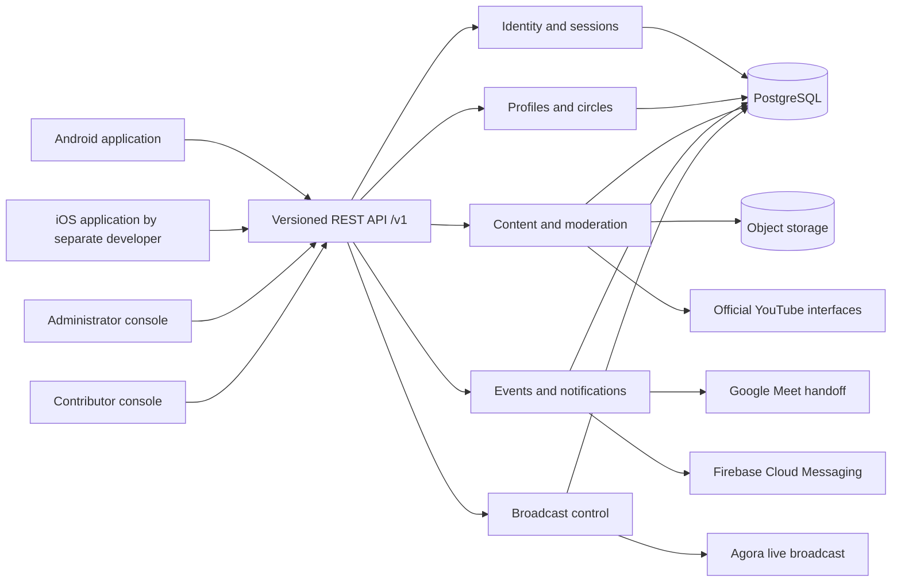
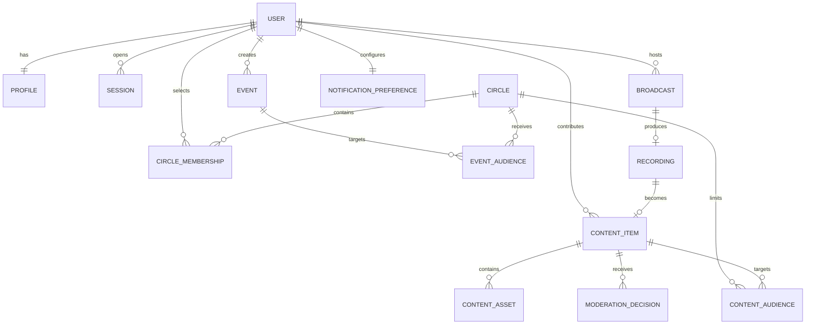

# Elder Engagement Platform Architecture Baseline

Status: Sprint 1 controlled baseline; development foundation implemented
Version: 0.3
Date: 12 September 2026
Product name: Amiko
Android package identifier: `com.eldercaresaathi.amiko`

## 1. Scope protected by this baseline

This architecture implements the approved engagement-platform backlog only. It supports Members, Contributors, and Administrators; detailed profiles; predefined circles; moderated video, audio, and PDF content; a feed; events and reminders; YouTube embedded playback; Google Meet or telephone handoff; Android; a shared REST API for iOS; and contributor-to-many live broadcasting with recording and replay.

Service booking, caregiver operations, wallets, memberships, payments, voice-health processing, custom multi-party calling, automatic translation, generated speech, and arbitrary no-code connectors are outside the approved production baseline.

## 2. Architecture decision

Use a modular monolith for version one. One versioned backend is simpler to secure, test, deploy, and operate within the fixed delivery period than independent microservices. Internal module boundaries preserve a later extraction path without adding distributed-system risk now.

## 3. Target Google Cloud deployment

The client-owned target uses separate development, staging, and production environments. Staging uses synthetic test data and has its own database, storage, provider credentials, secrets, and encryption context; it never receives a copy of production personal data. The target uses:

- Cloud Run for the stateless REST backend and web consoles.
- Cloud SQL for PostgreSQL as the transactional system of record.
- Cloud Storage for private uploaded media, documents, and approved replay assets.
- Secret Manager for provider credentials and signing material.
- Cloud Logging and Monitoring for structured logs, uptime, errors, latency, and budget alerts.
- A repeatable GitHub-based build and deployment pipeline with separate development and production configuration.

The approved development project is active in the selected India region. Its private Cloud Run service runs an immutable, security-checked image; authenticated health verification passes through keyless GitHub federation and Google Monitoring. Cloud SQL, storage, state and Secret Manager containers are private. Database baseline `V0001` has been applied once and verified. Error, uptime and budget alert rules are active; email delivery waits for the client-approved recipient. Staging and production are not yet created.

## 4. Backend modules and ownership

| Module | Responsibility | Primary data |
|---|---|---|
| Identity | Member one-time-password sign-in, Contributor credentials, stronger Administrator access, sessions, revocation | users, credentials, sessions, login attempts |
| Profiles | Detailed profile fields, language, interests, broad location, account controls | profiles, preferences, consent records |
| Circles | Predefined circles, suggestions, selections, membership rules | circles, circle rules, memberships |
| Content | Upload initiation/completion, metadata, visibility, feed queries | content items, assets, audience rules |
| Moderation | Pending queue, approval, rejection, reasons, audit history | moderation decisions, audit events |
| Events | Events, audiences, reminders, notification preferences | events, reminders, delivery state |
| External media | YouTube search/curation metadata and official embedded-playback references | external content references |
| Communication | Meet/telephone handoff references; no custom multi-party media engine | meeting references |
| Broadcast | Contributor broadcast scheduling, authorisation, state, viewer entitlement, recording and replay metadata | broadcasts, recordings, replay approvals |
| Operations | Health/readiness, structured logs, trace identifiers, rate limits, retention jobs | operational metadata |

## 5. REST API contract for Android and iOS

- All supported clients consume the same HTTPS JSON REST API under `/v1`.
- The OpenAPI document in GitHub is the interface source of truth.
- Authentication, permissions, validation, and audience filtering are enforced by the backend rather than trusted to a mobile client.
- Errors use one documented problem format with a stable machine-readable code and trace identifier.
- Breaking changes require a new major version such as `/v2` plus an agreed migration window. An exception requires explicit written approval from the client and iOS developer before an affected change is merged. Additive optional fields may remain in version 1.
- Every interface change must update the OpenAPI file, examples, automated contract checks, change log, and iOS notification record in the same pull request.
- Staging test access is supplied only after the client-owned environment and safe test identities exist.

## 6. Core data relationships

The physical schema must use immutable identifiers, timestamps, constrained status values, unique membership rules, and audit records. The client-approved data-lifecycle direction is recorded in `Amiko_Data_Lifecycle_Decision.md`; category-specific retention, broad-location wording and legal applicability remain to be finalised. An approved direction is not a deployed deletion/export or age-verification control.

## 7. Media and upload controls

- The backend issues short-lived, content-type and size-constrained upload authorisations.
- Uploaded files remain private and quarantined until completion checks and Administrator approval succeed.
- Allowed version-one formats are agreed video, audio, and PDF types only.
- File extension alone is never trusted; the service validates declared type, detected type, checksum, size, ownership, and moderation state.
- YouTube content is referenced and played through the official embedded player; the platform does not download, copy, rehost, or resell a YouTube video.
- Broadcast recordings enter the same approval and retention controls before becoming replay content.

## 8. Security baseline

- Deny access by default and authorise every protected operation by role, ownership, circle audience, and resource state.
- Use short-lived access tokens, rotating refresh sessions, revocation, and stronger Administrator authentication.
- Store no secret in source, mobile configuration, documentation, Postman files, or the tracker.
- Rate-limit sign-in, upload, search, moderation, and broadcast-control operations independently.
- Redact tokens, phone numbers, personal data, signed storage addresses, and provider secrets from logs.
- Attach a trace identifier to every request, error response, audit event, and operational log.
- Record Administrator and Contributor security-sensitive actions in an append-only audit trail.
- Separate development, staging, and production accounts, databases, storage, credentials, and encryption context; staging contains synthetic test data only.

## 9. Reliability and operations

- `/health` reports that the process is running without revealing configuration.
- `/ready` verifies required dependencies and returns unavailable when the service cannot safely accept traffic.
- Database changes are immutable, reviewed migrations rather than runtime table creation.
- Production changes are built and checked from GitHub; manual server editing is prohibited.
- Backups, restoration evidence, uptime, error rate, latency, broadcast health, storage growth, provider quota, and budget thresholds are monitored.
- Every production release has a documented rollback path and previous known-good version.

## 10. Decisions still required from the client

- Public domains and the timing/identifiers for separate staging and production projects.
- Complete profile fields, circle rules, and account-control policy.
- Final privacy notice, consent wording, location wording, category-specific retention periods, manual-backup and recording expiry, and legal applicability review. The adult-only launch and data-request/deletion service targets are approved but not yet implemented.
- Identity Platform/Firebase configuration and fictional test numbers. The approved Member journey is verified-phone sign-in followed by immediate access and self-created profile; Contributors are Administrator-created.
- YouTube, Meet, Firebase Cloud Messaging, and Agora client-owned accounts and quotas.
- Broadcast duration, viewer launch cap, consent, replay approval, and retention.
- iOS developer contact, GitHub identity, expected integration scenarios, and response availability.

Until these decisions arrive, code must use explicit configuration or mocks and may not silently choose a permanent production value.
